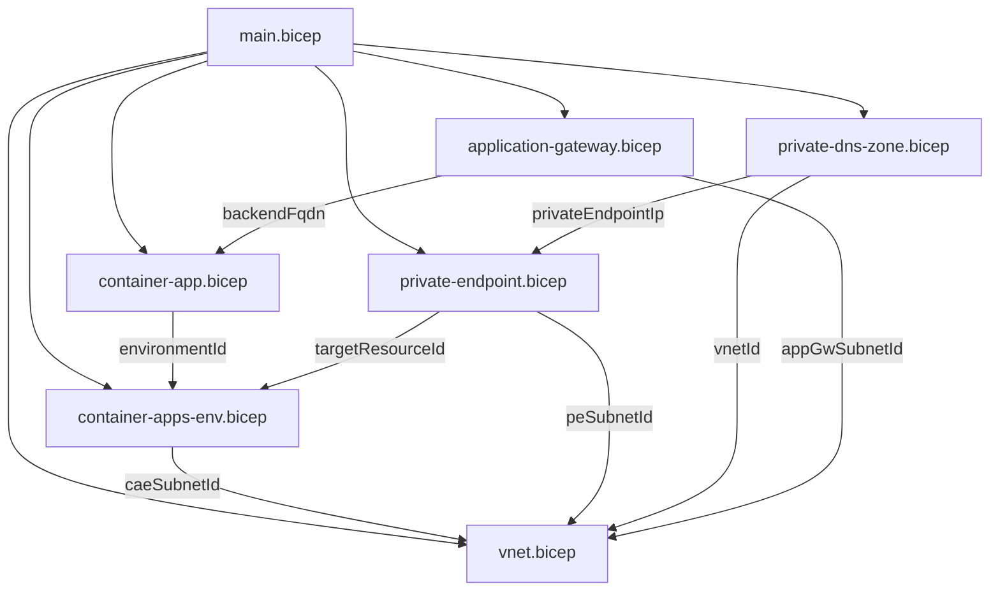

# Bicep Module Contracts

このドキュメントでは、各Bicepモジュールの入出力インターフェースを定義します。

## 1. main.bicep

メインデプロイメントファイル。すべてのモジュールをオーケストレーションします。

### Parameters

```bicep
@description('デプロイ先のAzureリージョン')
param location string = 'japaneast'

@description('リソース名のプレフィックス')
param prefix string = 'acaeval'

@description('Container Apps環境のpublic network access設定')
@allowed(['Enabled', 'Disabled'])
param publicNetworkAccess string = 'Enabled'
```

### Outputs

```bicep
@description('Application GatewayのパブリックIP')
output appGatewayPublicIp string

@description('Container AppのFQDN')
output containerAppFqdn string

@description('Private EndpointのプライベートIP')
output privateEndpointIp string
```

---

## 2. modules/vnet.bicep

Virtual Networkとサブネットを作成します。

### Parameters

```bicep
@description('VNet名')
param name string

@description('リージョン')
param location string

@description('VNetのアドレス空間')
param addressPrefix string = '10.0.0.0/16'

@description('Application Gatewayサブネットのアドレスプレフィックス')
param appGwSubnetPrefix string = '10.0.1.0/24'

@description('Private Endpointサブネットのアドレスプレフィックス')
param peSubnetPrefix string = '10.0.2.0/24'

@description('Container Apps Environmentサブネットのアドレスプレフィックス')
param caeSubnetPrefix string = '10.0.16.0/23'
```

### Outputs

```bicep
@description('VNetのリソースID')
output vnetId string

@description('Application Gatewayサブネットのリソースid')
output appGwSubnetId string

@description('Private EndpointサブネットのリソースID')
output peSubnetId string

@description('Container Apps EnvironmentサブネットのリソースID')
output caeSubnetId string
```

---

## 3. modules/container-apps-env.bicep

Container Apps Environmentを作成します（Workload Profiles）。

### Parameters

```bicep
@description('環境名')
param name string

@description('リージョン')
param location string

@description('インフラストラクチャサブネットID')
param infrastructureSubnetId string

@description('public network access設定')
@allowed(['Enabled', 'Disabled'])
param publicNetworkAccess string = 'Enabled'
```

### Outputs

```bicep
@description('Container Apps EnvironmentのリソースID')
output id string

@description('デフォルトドメイン')
output defaultDomain string

@description('静的IP')
output staticIp string
```

---

## 4. modules/container-app.bicep

コンテナアプリを作成します。

### Parameters

```bicep
@description('アプリ名')
param name string

@description('リージョン')
param location string

@description('Container Apps EnvironmentのリソースID')
param environmentId string

@description('コンテナイメージ')
param containerImage string = 'mcr.microsoft.com/k8se/quickstart:latest'

@description('ターゲットポート')
param targetPort int = 80

@description('外部Ingress有効化')
param externalIngress bool = true
```

### Outputs

```bicep
@description('Container AppのリソースID')
output id string

@description('Container AppのFQDN')
output fqdn string
```

---

## 5. modules/private-endpoint.bicep

Private Endpointを作成します。

### Parameters

```bicep
@description('Private Endpoint名')
param name string

@description('リージョン')
param location string

@description('Private Endpointを配置するサブネットID')
param subnetId string

@description('ターゲットリソースID（Container Apps Environment）')
param targetResourceId string

@description('グループID')
param groupIds array = ['managedEnvironments']
```

### Outputs

```bicep
@description('Private EndpointのリソースID')
output id string

@description('Private EndpointのプライベートIPアドレス')
output privateIpAddress string
```

---

## 6. modules/private-dns-zone.bicep

Private DNS Zoneを作成し、VNetにリンクします。

### Parameters

```bicep
@description('DNS Zone名（Container Apps Environmentのdefault domain）')
param zoneName string

@description('リンクするVNetのリソースID')
param vnetId string

@description('Private EndpointのプライベートIPアドレス')
param privateEndpointIp string
```

### Outputs

```bicep
@description('Private DNS ZoneのリソースID')
output id string
```

---

## 7. modules/application-gateway.bicep

Application Gateway (Standard_v2) を作成します。

### Parameters

```bicep
@description('Application Gateway名')
param name string

@description('リージョン')
param location string

@description('Application GatewayサブネットID')
param subnetId string

@description('バックエンドのFQDN（Container App）')
param backendFqdn string
```

### Outputs

```bicep
@description('Application GatewayのリソースID')
output id string

@description('Application GatewayのパブリックIPアドレス')
output publicIpAddress string
```

---

## Module Dependencies



## Deployment Order

### publicNetworkAccess = Enabled の場合

1. `vnet.bicep` - ネットワーク基盤
2. `container-apps-env.bicep` - Container Apps環境
3. `container-app.bicep` - コンテナアプリ
4. `application-gateway.bicep` - Application Gateway

> **Note**: Private Endpoint と Private DNS Zone はスキップ

### publicNetworkAccess = Disabled の場合

1. `vnet.bicep` - ネットワーク基盤
2. `container-apps-env.bicep` - Container Apps環境
3. `container-app.bicep` - コンテナアプリ
4. `private-endpoint.bicep` - プライベートエンドポイント（**条件付き**）
5. `private-dns-zone.bicep` - プライベートDNS（**条件付き**）
6. `application-gateway.bicep` - Application Gateway

> **重要**: Azure Container Apps では Private Endpoint を作成するには `publicNetworkAccess = Disabled` が必須です。
> そのため、main.bicep では条件付きデプロイを使用しています。
