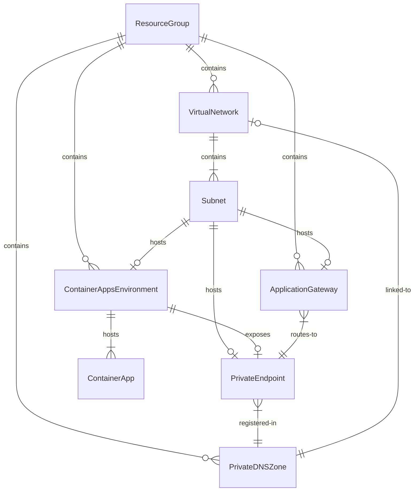

# Data Model: Azure Container Apps + Application Gateway アクセス制御検証

**Date**: 2025-12-09  
**Feature**: 001-aca-accessibility-control

## Overview

このドキュメントでは、検証に必要なAzureリソースとその関係性を定義します。

## Entity Definitions

### 1. Resource Group

| Attribute | Type | Description |
|-----------|------|-------------|
| name | string | `rg-aca-accessibility-eval` |
| location | string | `japaneast` |

### 2. Virtual Network

| Attribute | Type | Description |
|-----------|------|-------------|
| name | string | `vnet-{prefix}` (デフォルト: `vnet-acaeval`) |
| addressSpace | string | `10.0.0.0/16` |
| subnets | array | 下記参照 |

**Subnets**:

| Subnet Name | Address Prefix | Purpose |
|-------------|----------------|---------|
| `snet-appgw` | `10.0.1.0/24` | Application Gateway用 |
| `snet-pe` | `10.0.2.0/24` | Private Endpoint用 |
| `snet-cae` | `10.0.16.0/23` | Container Apps Environment用（Workload Profiles要件：最小/27） |

### 3. Container Apps Environment

| Attribute | Type | Description |
|-----------|------|-------------|
| name | string | `cae-{prefix}` (デフォルト: `cae-acaeval`) |
| type | string | `Workload Profiles` (プライベートエンドポイントサポートに必須) |
| vipType | string | `External` (検証シナリオ) |
| publicNetworkAccess | string | `Disabled` (検証完了後に変更) |
| infrastructureSubnetId | string | `snet-cae`のリソースID |
| defaultDomain | string | (自動生成) Container Apps環境のデフォルトドメイン |
| staticIp | string | (自動生成) Container Apps環境の静的IP |

### 4. Container App

| Attribute | Type | Description |
|-----------|------|-------------|
| name | string | `ca-{prefix}` (デフォルト: `ca-acaeval`) |
| environmentId | string | Container Apps EnvironmentのリソースID |
| ingress.external | bool | `true` |
| ingress.targetPort | int | `80` |
| ingress.transport | string | `auto` |
| containers[0].image | string | `mcr.microsoft.com/k8se/quickstart:latest` |
| containers[0].name | string | `hello` |
| fqdn | string | (自動生成) `ca-{prefix}.<defaultDomain>` |

### 5. Private Endpoint

> **重要**: Azure Container Apps では Private Endpoint を作成するには `publicNetworkAccess = Disabled` が必須です。
> そのため、このリソースは `publicNetworkAccess = Disabled` の場合のみデプロイされます。

| Attribute | Type | Description |
|-----------|------|-------------|
| name | string | `pe-{prefix}` (デフォルト: `pe-acaeval`) |
| subnetId | string | `snet-pe`のリソースID |
| privateLinkServiceConnectionName | string | `plsc-{prefix}` |
| groupIds | array | `['managedEnvironments']` |
| targetResourceId | string | Container Apps EnvironmentのリソースID |
| privateIPAddress | string | (自動割り当て) Private Endpoint IP |

### 6. Private DNS Zone

> **Note**: Private Endpoint と同様、`publicNetworkAccess = Disabled` の場合のみデプロイされます。

| Attribute | Type | Description |
|-----------|------|-------------|
| name | string | Container Apps Environmentの`defaultDomain` |
| virtualNetworkLinks[0].name | string | `link-vnet-{prefix}` |
| virtualNetworkLinks[0].virtualNetworkId | string | VNetのリソースID |

**DNS Records**:

| Record Name | Type | TTL | Value |
|-------------|------|-----|-------|
| `*` | A | 3600 | Private Endpoint IP |
| `@` | A | 3600 | Private Endpoint IP |

### 7. Application Gateway

| Attribute | Type | Description |
|-----------|------|-------------|
| name | string | `agw-{prefix}` (デフォルト: `agw-acaeval`) |
| sku.name | string | `Standard_v2` |
| sku.tier | string | `Standard_v2` |
| gatewayIPConfigurations[0].subnetId | string | `snet-appgw`のリソースID |

**Frontend Configuration**:

| Component | Attribute | Value |
|-----------|-----------|-------|
| Public IP | name | `pip-agw-{prefix}` |
| Public IP | sku | `Standard` |
| Public IP | allocation | `Static` |
| Frontend IP | name | `feip-public` |
| Frontend Port | name | `feport-http` |
| Frontend Port | port | `80` |

**Backend Configuration**:

| Component | Attribute | Value |
|-----------|-----------|-------|
| Backend Pool | name | `bepool-aca` |
| Backend Pool | targets[0].fqdn | `ca-{prefix}.<defaultDomain>` |
| Backend Settings | name | `besettings-https` |
| Backend Settings | protocol | `Https` |
| Backend Settings | port | `443` |
| Backend Settings | pickHostNameFromBackendAddress | `true` |
| Backend Settings | trustedRootCertificates | (Azure既知CA使用) |

**Health Probe**:

| Attribute | Value |
|-----------|-------|
| name | `probe-aca` |
| protocol | `Https` |
| path | `/` |
| interval | `30` |
| timeout | `30` |
| unhealthyThreshold | `3` |
| pickHostNameFromBackendHttpSettings | `true` |

**Routing Rule**:

| Attribute | Value |
|-----------|-------|
| name | `rule-basic` |
| priority | `100` |
| ruleType | `Basic` |
| httpListenerName | `listener-http` |
| backendAddressPoolName | `bepool-aca` |
| backendHttpSettingsName | `besettings-https` |

## Entity Relationships



## State Transitions

### Container Apps Environment Public Network Access

> **重要**: Azure Container Apps では Private Endpoint を作成するには `publicNetworkAccess = Disabled` が必須です。
> そのため、Bicep では条件付きデプロイを使用しています。

```
┌──────────────────────────────────┐
│   publicNetworkAccess = Enabled  │
│   (Private Endpoint なし)         │
└────────────┬─────────────────────┘
             │ 
             │ az deployment group create \
             │   --parameters publicNetworkAccess=Disabled
             │ 
             │ → Private Endpoint 作成
             │ → Private DNS Zone 作成
             ▼
┌──────────────────────────────────┐
│   publicNetworkAccess = Disabled │
│   (Private Endpoint あり)         │
└──────────────────────────────────┘
```

### Validation States

| State | AppGW → CA | Internet → CA FQDN | Private Endpoint | Description |
|-------|------------|-------------------|------------------|-------------|
| Enabled | ✅ via Public FQDN | ✅ | なし | 初期状態 |
| Disabled | ✅ via Private Endpoint | ❌ | あり | 検証目標状態 |
